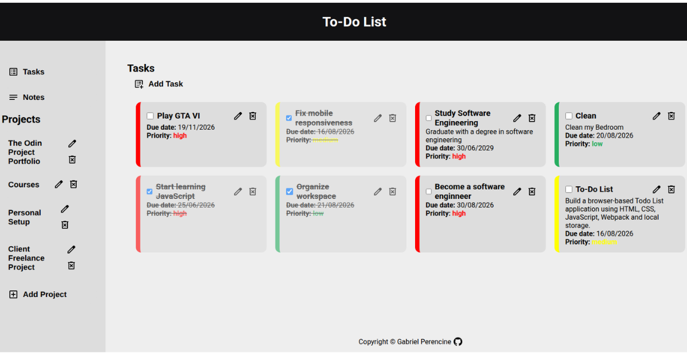

# Todo List

This project is part of the JavaScript course from **The Odin Project**. In this project, I built a browser-based Todo List application using HTML, CSS, JavaScript, and Webpack, allowing users to organize projects and manage tasks through an interactive interface.

## Preview

By completing this project, I demonstrated an understanding of JavaScript modules, object-oriented programming, application state management, DOM manipulation, localStorage persistence, event handling, and dynamic user interfaces. I also strengthened my ability to separate business logic from presentation, structure scalable applications, and manage persistent client-side data.

This project marked an important milestone in building complete JavaScript applications by combining modular architecture, persistent storage, and interactive task management into a single project.